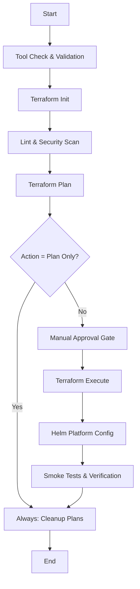

# Jenkins Pipeline Walkthrough & Operations Guide

This document explains the design, stage workflow, and configuration requirements for the Platform Team's CI/CD pipeline defined in the root [`Jenkinsfile`](file:///d:/trainings/platform_jenkins_emr_eks_pipeline/Jenkinsfile).

---

## 🛠️ Jenkins Architecture & Plugin Requirements

To run this pipeline, ensure your Jenkins master and agent nodes satisfy the following requirements:

### Required Plugins
1. **Pipeline Plugin**: Core pipeline engine.
2. **Credentials Binding Plugin**: For injecting AWS secrets securely.
3. **AnsiColor Plugin**: Enables ANSI color codes in console output (essential for readable Terraform diffs).
4. **Git Plugin**: Handles workspace checkouts.

### Agent Environment
The Jenkins agent must be configured with command-line tools:
- **`aws`** (AWS CLI) with sufficient permissions to call EKS, EMR, VPC, and IAM APIs.
- **`terraform`** (v1.3+) to provision infrastructure.
- **`kubectl`** to manage Kubernetes resources.
- **`helm`** (v3+) to install platform packages.

---

## 📦 Jenkins Pipeline Stages Breakdown

The declarative pipeline is structured into discrete, sequential stages. Below is a detailed walkthrough of each stage's operations:



### 1. Tool Check & Validation
- **Actions**: Sets executable permissions on helper shell scripts (`chmod +x scripts/*.sh`) and runs `./scripts/check-prereqs.sh`.
- **Behavior**: If required binaries (`aws`, `terraform`, `kubectl`, `helm`) are missing from the build agent path, the pipeline fails early before performing cloud operations.

### 2. Terraform Init
- **Actions**: Resolves modules and initializes the S3 backend dynamically:
  ```bash
  terraform init \
      -backend-config="bucket=${params.TF_STATE_BUCKET}" \
      -backend-config="key=environments/${params.ENVIRONMENT}/terraform.tfstate" \
      -backend-config="region=${params.AWS_REGION}" \
      -backend-config="dynamodb_table=${params.TF_STATE_LOCK_TABLE}" \
      -reconfigure
  ```
- **Rationale**: Reconfigures the state backend dynamically per environment (`dev`, `staging`, `prod`) to enforce environment state isolation without hardcoding bucket configurations inside the code.

### 3. Lint & Security Scan
- **Actions**: 
  - Runs `terraform fmt -check` to verify code format.
  - Dynamically runs `tfsec` or `checkov` (if available on the agent) to perform static security analysis.
  - Runs `helm lint helm/platform-charts` to catch templates issues before deployment.

### 4. Terraform Plan
- **Actions**: Builds an execution plan and writes it to a file.
  - For **Apply (Deploy)**: Generates `tfapply.plan` containing additions/updates.
  - For **Destroy (Teardown)**: Generates `tfdestroy.plan` containing deletions.

### 5. Manual Approval Gate
- **Actions**: Utilizes the Jenkins pipeline `input` step.
- **Behavior**:
  - Automatically skips approval for the `dev` environment on deploy actions.
  - Halts execution for user confirmation for **Staging/Production** environments, or for **Destroy (Teardown)** actions in *any* environment.

### 6. Terraform Execute
- **Actions**: Executes the saved plan file (`terraform apply <plan>`).
- **Rationale**: Applying a pre-generated plan guarantees that only the changes inspected during the plan stage are applied, eliminating race conditions.

### 7. Helm Platform Config
- **Actions**:
  - Configures `kubectl` credentials for the newly created EKS cluster:
    `aws eks update-kubeconfig --name ${params.ENVIRONMENT}-${params.CLUSTER_NAME} --region ${params.AWS_REGION}`
  - Fetches the EMR Spark Execution Role ARN dynamically from Terraform output variables.
  - Installs/Upgrades the platform Helm chart using `helm upgrade --install`.

### 8. Smoke Tests & Verification
- **Actions**: Runs `./scripts/verify-deployment.sh`.
- **Behavior**: Verifies API server connectivity, outputs namespace resource configurations, and polls the EMR Virtual Cluster state to verify it transitions to `RUNNING`.

---

## 🐳 Running Jenkins in Docker & CLI Tool Installation

To run this pipeline inside a Docker container, the Jenkins runner must have access to `aws`, `terraform`, `kubectl`, and `helm`. We provide a custom Dockerfile at [`jenkins/Dockerfile`](file:///d:/trainings/platform_jenkins_emr_eks_pipeline/jenkins/Dockerfile) to build an image pre-packaged with all required binaries.

### Build and Run Steps

1. **Build the Custom Jenkins Image**:
   Navigate to the directory containing the `Dockerfile` and run:
   ```bash
   docker build -t custom-jenkins-agent -f jenkins/Dockerfile .
   ```

2. **Launch the Container**:
   Run the following command to spin up the container with persistent volume storage for your configuration:
   ```bash
   docker run -d \
     -p 8080:8080 \
     -p 50000:50000 \
     -v jenkins_home:/var/jenkins_home \
     --name platform-jenkins \
     custom-jenkins-agent
   ```

3. **Verification**:
   Once the container starts, verify that the tools are present on the container path:
   ```bash
   docker exec -it platform-jenkins aws --version
   docker exec -it platform-jenkins terraform --version
   docker exec -it platform-jenkins kubectl version --client
   docker exec -it platform-jenkins helm version
   ```

---

## 🔒 Security Best Practices

### Credentials Handling
The pipeline binds credentials via `withCredentials`:
```groovy
withCredentials([aws(credentialsId: env.AWS_CRED_ID, accessKeyVariable: 'AWS_ACCESS_KEY_ID', secretKeyVariable: 'AWS_SECRET_ACCESS_KEY')]) { ... }
```
* **Best Practice**: For production Jenkins clusters hosted on AWS EC2 or EKS, **do not** use long-lived credential bindings. Instead, associate a IAM Instance Profile or an EKS IAM Role for Service Accounts (IRSA) with your Jenkins agent, allowing AWS authentication to happen seamlessly and securely without credential management.

### Workspace Cleanup
The `post` block runs `rm -f terraform/*.plan` to delete sensitive plan files containing configuration details or potential secrets.
